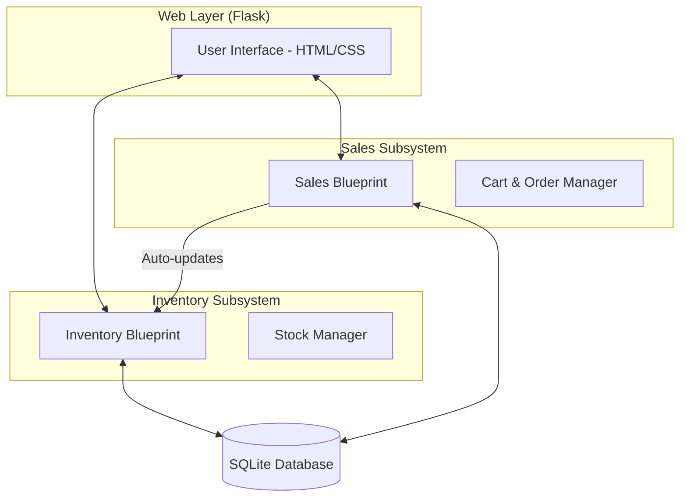
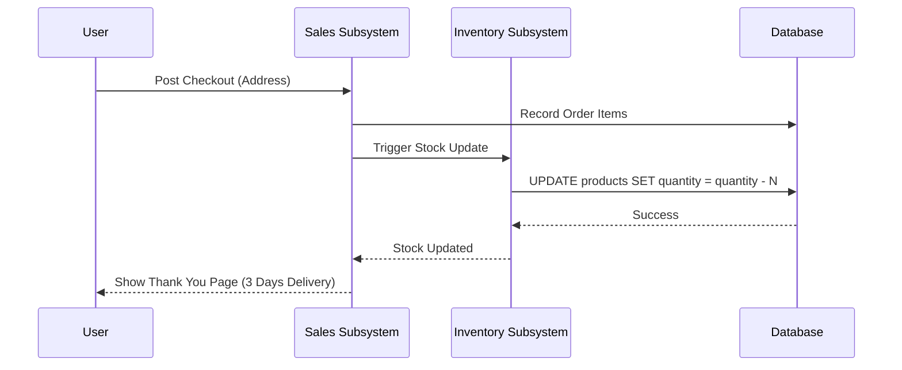
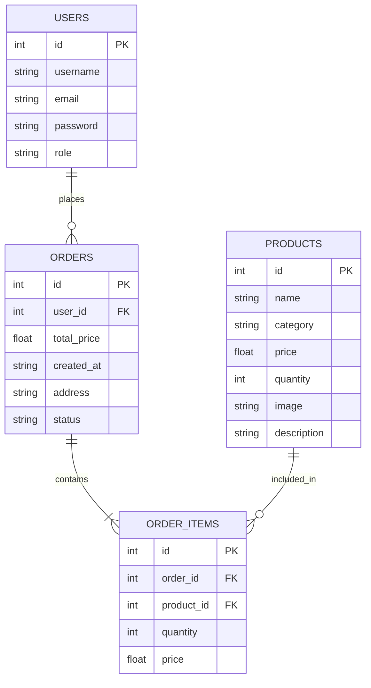
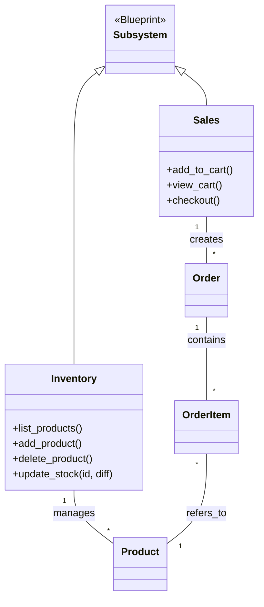

# System Design Artifacts

This document contains the visual design models for the Computer Shop ERP system, as required for the Software Engineering Lab deliverables.

## 1. Use Case Diagram
Describes the interactions between the users (Admin, Customer) and the system.

```mermaid
useCaseDiagram
    actor Customer
    actor Admin
    
    package "ERP System" {
        usecase "Browse Products" as UC1
        usecase "Add to Cart" as UC2
        usecase "Complete Checkout" as UC3
        usecase "Manage Inventory" as UC4
        usecase "Add New Hardware" as UC5
        usecase "Login/Register" as UC6
    }
    
    Customer --> UC1
    Customer --> UC2
    Customer --> UC3
    Customer --> UC6
    
    Admin --> UC4
    Admin --> UC5
    Admin --> UC6
```

## 2. Software Architecture Diagram
Shows the high-level modular structure of the two integrated subsystems.



## 3. Sequence Diagram (Order Flow)
Illustrates the communication between subsystems during a purchase.



## 4. Entity Relationship Diagram (ERD)
Defines the data structure of the integrated ERP database.



## 5. Class Diagram
Represents the structural model of the modular implementation.


